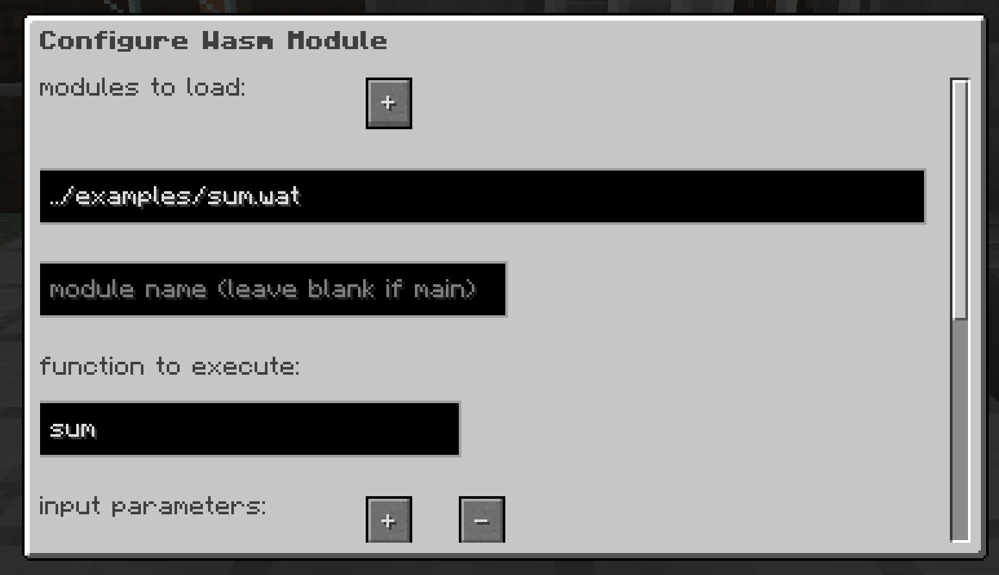
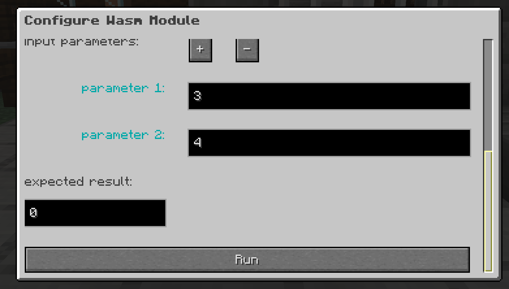

# WebAssembly in MineCraft Fabric Mod

## Requirements:
* Minecraft 1.17.1
* Fabric https://fabricmc.net

## Setup

Download the file `fabric-wasmcraft-mod-1.0.0.jar` from releases and copy to your MineCraft mods folder.

## Using

To run a WASM module in MineCraft first place a `wasmcraft` block.

Once the block has been placed you can right click on the block to bring up the configuration menu.

In this menu configure the name of the module you would like to load (filepaths are relative to the MineCraft folder).

Set the module name if using multiple modules.

Configure your parameters, If the parameter is a string, Wasmcraft will automatically attempt to write this to the modules
memory. This feature requires the module to expose the functions `allocate` and `deallocate`, please see the example Go ABI
for more info (./examples/go_complex/abi/abi.go)

Configure the expected value, all functions that are executed by WasmCraft require that the function has a return value.
This can either be a String pointer or a simple I32.

Finally press the `run` button and `esc` to dismiss the menu. If the function executed correctly and the exepected
value matches the value returned from the function the block will change to `a green smily face`.

## Example modules

### Go

#### Go Simple ./examples/go_simple
Simple Go module with Wasi compiled with TinyGo

#### Go String ./examples/go_string
Example showing how to interact with Wasm memory allowing complex types

#### Go Complex ./examples/go_complex
Example implementing AES encyption and decryption as a WASM module. Leverages WASI filesystem.

### AssemblyScript

#### ./examples/assemblyscript
Various examples including writing and reading to WASM memory and complex types

### Rust

#### ./examples/rust
Various examples showing complex types, host functions and imported module functions

## References

* wasmtime-java https://github.com/kawamuray/wasmtime-java
* TinyGo https://tinygo.org
* Wasmtime docs https://docs.wasmtime.dev
* WASI - https://github.com/WebAssembly/WASI
* WASI Networking - https://github.com/WebAssembly/WASI/pull/312
